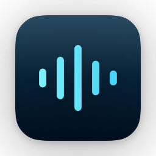
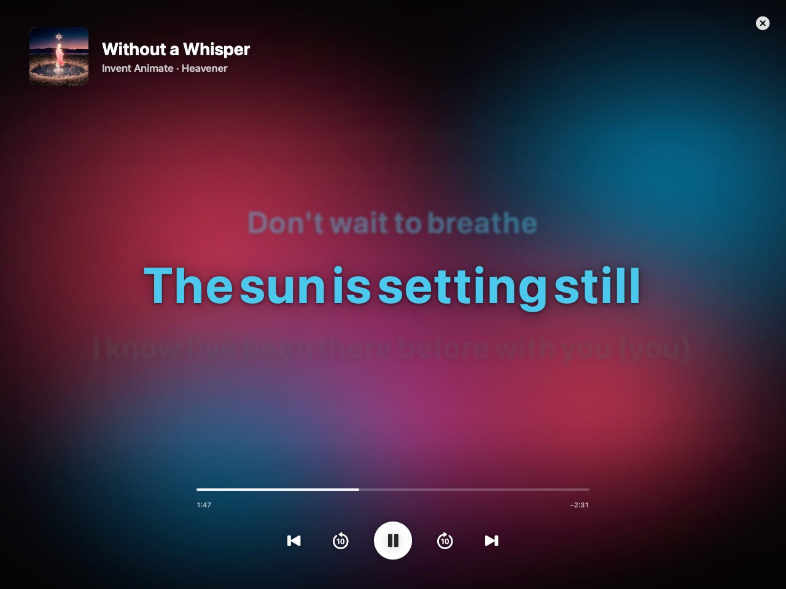
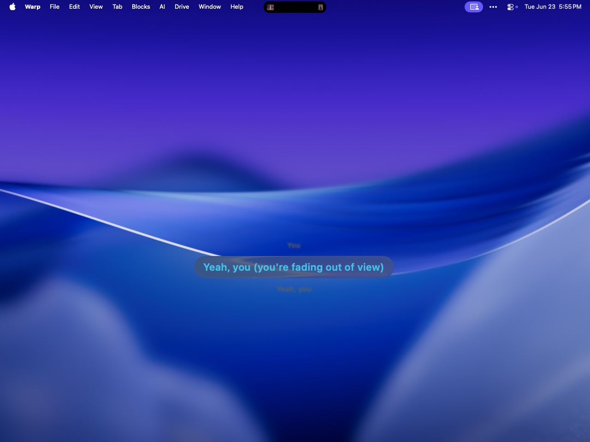
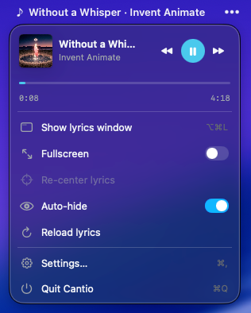

<p align="center">
  
</p>

<h1 align="center">Cantio</h1>

<p align="center">
  <em>Karaoke-grade Spotify lyrics, floating over your desktop.</em>
</p>

<p align="center">
  Time-synced lyrics in a menu-bar app that looks like Apple shipped it.<br/>
  Reads Spotify locally — no Web API, no OAuth, no telemetry.
</p>

<p align="center">
  <a href="https://github.com/notuselessdev/cantio/releases/latest"></a>
  <a href="https://github.com/notuselessdev/cantio/blob/main/LICENSE"></a>
  
  
</p>

<p align="center">
  
  
  <br/>
  <em>Fullscreen karaoke view · floating pill over the desktop</em>
</p>

---

Cantio shows the lyrics of whatever's playing in Spotify, synced line-by-line, in a floating pill over your desktop — or a fullscreen karaoke view with an album-art-tinted backdrop. It reads the track straight from the local Spotify app over AppleScript, so there are no API keys, no logins, and the only thing it ever sends over the network is a lyrics lookup to [LRCLIB](https://lrclib.net).

## Install

### Homebrew (recommended)

```sh
brew install --cask --no-quarantine notuselessdev/tap/cantio
```

`--no-quarantine` is required: Cantio isn't signed with a paid Apple Developer ID, so the flag tells macOS to skip the Gatekeeper prompt. Update later with `brew upgrade`.

### Manual

Download the DMG from the [latest release](https://github.com/notuselessdev/cantio/releases/latest), drag **Cantio** to Applications, then on first launch **right-click → Open** (or run):

```sh
xattr -dr com.apple.quarantine /Applications/Cantio.app
```

Cantio lives in the menu bar (no Dock icon) — look for the music-note glyph.

## Features



- **Synced lyrics** — line-by-line highlight that tracks playback position
- **Two looks** — a draggable floating pill, or a fullscreen karaoke view
- **Fullscreen karaoke** — large lyrics, album-art-tinted floating backdrop, auto-hiding transport controls (play/pause, ±10s seek, prev/next) and a scrubber
- **Menu-bar controls** — playback, scrubber, and quick toggles from the status item
- **Double-click the pill** to go fullscreen; double-click or `Esc` to come back
- **Native feel** — glass materials, alignment guides while dragging, honors Reduce Motion / Reduce Transparency / VoiceOver
- **Private by design** — playback read locally via AppleScript; the only network call is the LRCLIB lyrics lookup

<br clear="all" />

## How it works

| Piece | What it does |
|-------|--------------|
| `SpotifyMonitor` | Polls the local Spotify app over AppleScript for the now-playing track + position |
| `LyricsService` | Fetches timed lyrics from LRCLIB, cached to disk per track |
| `FloatingLyricsController` | Owns the borderless overlay window (pill / fullscreen), drag + click-through |
| `ArtworkColors` | Derives the backdrop hues from the album cover |

Spotify automation permission is requested lazily on first use, never at launch.

## Build from source

The Xcode project is generated from `project.yml` with [XcodeGen](https://github.com/yonaskolb/XcodeGen).

```sh
brew install xcodegen
xcodegen generate
open Cantio.xcodeproj
```

Or from the command line:

```sh
xcodegen generate
xcodebuild -project Cantio.xcodeproj -scheme Cantio -configuration Debug build
```

`Cantio.xcodeproj` is generated — edit `project.yml`, not the pbxproj.

### Packaging

```sh
scripts/build-unsigned.sh    # ad-hoc-signed universal DMG (what releases ship)
```

`scripts/build-release.sh` is the notarized path (hardened runtime, Developer ID, stapled) for when a paid Apple Developer account is available — see the script header for the required env vars.

## License

MIT — see [LICENSE](LICENSE).
